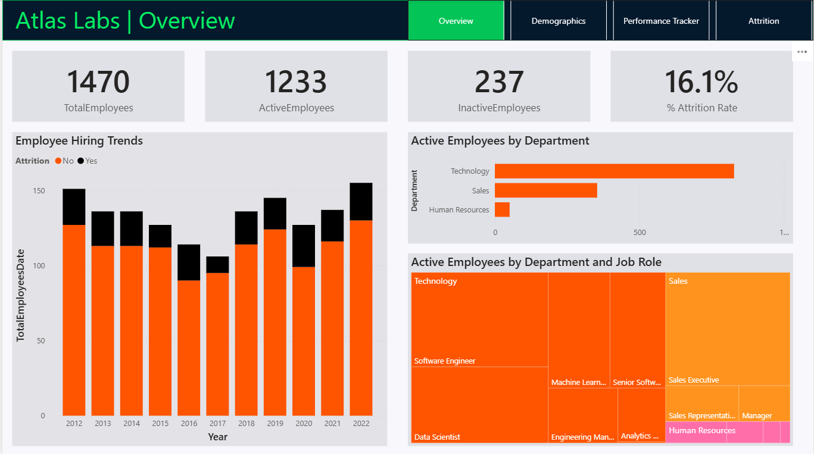
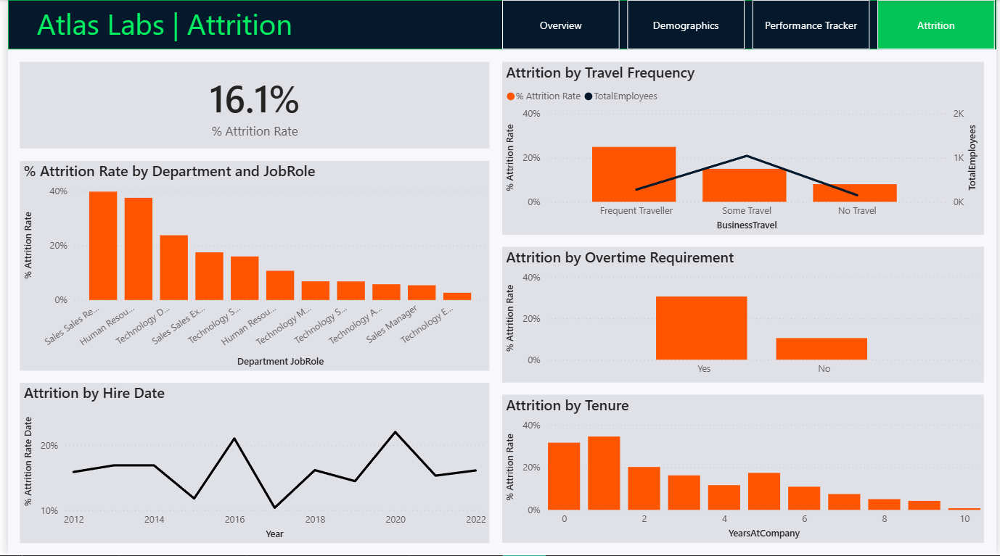
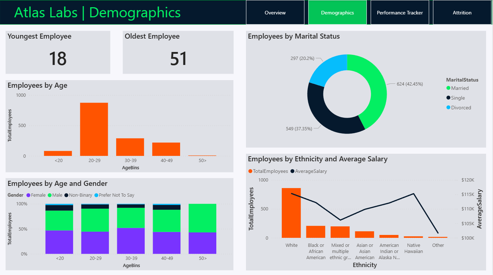

# 👥 HR360 Analytics: Workforce Performance & Attrition Dashboard

A comprehensive and interactive Power BI dashboard designed to analyze employee performance, satisfaction, and attrition trends—enabling HR professionals and recruiters to make informed, data-driven decisions.

---

## 🎯 Short Description / Purpose

The HR360 Analytics Dashboard provides a visual and analytical overview of employee behavior and performance metrics. It helps HR teams identify patterns in attrition, satisfaction, and training participation across various demographic segments. This tool is ideal for workforce strategists, recruiters, and HR managers aiming to improve retention and optimize employee engagement.

---

## 🧩 Data Model: Snowflake Schema Overview

This project uses a **Snowflake Schema**, which promotes data integrity and reduces redundancy by normalizing dimension tables. While this structure is ideal for maintaining clean relationships and scalable data modeling, tools like Power BI may require optimization techniques to ensure smooth performance.

### 🗂️ Core Tables & Relationships

The central fact table is:

- **`Performance`**  
  Contains employee performance reviews, satisfaction ratings, training metrics, and both self and manager evaluations.

This fact table connects to several dimension tables:

#### 📌 Dimension Tables

| Table Name         | Description                                                                 |
|--------------------|-----------------------------------------------------------------------------|
| `Employee`         | Contains demographic, job role, education, and tenure details for each employee |
| `SatisfiedLevel`   | Maps numeric satisfaction scores to descriptive levels (e.g., Very Satisfied, Neutral) |
| `RatingLevel`      | Maps performance ratings to qualitative labels (e.g., Exceeds Expectations, Unacceptable) |
| `EducationLevel`   | Maps education codes to formal qualifications (e.g., Masters, High School) |

#### 📐 Measures

The model includes calculated measures such as:

- Average satisfaction scores across categories
- Training participation rates
- Performance rating distributions
- Attrition-linked performance trends

### 🔗 Relationships

- `Performance.EmployeeID` → `Employee.EmployeeID`  
- `Performance.EnvironmentSatisfaction`, `JobSatisfaction`, `RelationshipSatisfaction`, `WorkLifeBalance` → `SatisfiedLevel.SatisfactionID`  
- `Performance.SelfRating`, `ManagerRating` → `RatingLevel.RatingID`  
- `Employee.Education` → `EducationLevel.EducationLevelID`

This structure enables flexible slicing and dicing of performance data across multiple dimensions while maintaining referential integrity.

---

## 🛠️ Tech Stack

The dashboard was built using the following tools and technologies:

- 📊 **Power BI Desktop** – Main data visualization platform used for report creation.
- 📂 **Power Query Editor** – Data transformation and cleaning layer for reshaping and preparing the data.
- 🧠 **DAX (Data Analysis Expressions)** – Used for calculated measures, dynamic visuals, and conditional logic.
- 🧱 **Snowflake Schema Modeling** – Normalized structure for scalable and clean relationships.
- 📁 **File Format** – `.pbix` for development and `.png` for dashboard previews.

---

## 📚 Data Source

**Source**: Simulated HR dataset

The dataset includes:
- Employee demographics (age, gender, education, job role)
- Performance metrics (ratings, satisfaction scores, training participation)
- Attrition status (Yes/No)
- Mapping tables for satisfaction levels, rating categories, and education levels

---

## 🌟 Features / Highlights

### • Business Problem

HR departments often face challenges in understanding the root causes of employee attrition and performance variability. Without a unified analytical view, it's difficult to identify high-risk segments or evaluate the impact of training and satisfaction on retention.

### • Goal of the Dashboard

To deliver a visual analytics tool that:
- Tracks employee performance and satisfaction trends
- Identifies potential attrition risks
- Supports HR decisions on training, retention, and recruitment
- Enables segmentation by demographics, education, and job roles

### • Walkthrough of Key Visuals

- **📌 Overview Panel**
  - Total Employees
  - Attrition Rate
  - Average Satisfaction Score
  - Training Participation

- **📊 Attrition Analysis**
  - Heatmap showing attrition by job role and education level
  - KPI cards for attrition-linked performance metrics

- **🧍 Demographics Breakdown**
  - Pie and bar charts for gender, education, and job role distribution
  - Attrition segmented by demographic categories

- **📈 Performance Tracker**
  - Line and column charts showing satisfaction vs. rating correlation
  - Training frequency across performance tiers

- **🎛️ Interactive Filters**
  - Slicers for education level, job role, gender, satisfaction score, and rating

### • Business Impact & Insights

- 🔍 **Retention Strategy**: Identify employee segments with high attrition risk and low satisfaction.
- 📈 **Training Optimization**: Evaluate training participation across performance levels.
- 🎯 **Targeted Recruitment**: Focus hiring efforts on roles with high turnover.
- 🧩 **Strategic HR Planning**: Design better engagement and development programs.

---

## 🖼️ Screenshots / Demos

### 📊 Dashboard Overview  

### 📈 Attrition Analysis  

### 🧍 Demographics Breakdown  

### 📄 Performance Tracker  

---

## 📁 Report File

To explore the dashboard in Power BI:

- Download the report file: [`HR_Analytics.pbix`](HR_Analytics.pbix)

---

## 🚀 Getting Started

1. Clone this repository  
2. Open `HR_Analytics.pbix` in Power BI Desktop  
3. Use slicers to filter by education, job role, and satisfaction  
4. Analyze attrition and performance trends across segments  

---

## 📬 Contact

For questions, feedback, or collaboration:

- **GitHub**: [arvind207kumar](https://github.com/arvind207kumar)
- **Linkedin**: https://www.linkedin.com/in/arvind-kumar-560885231/ 

---

